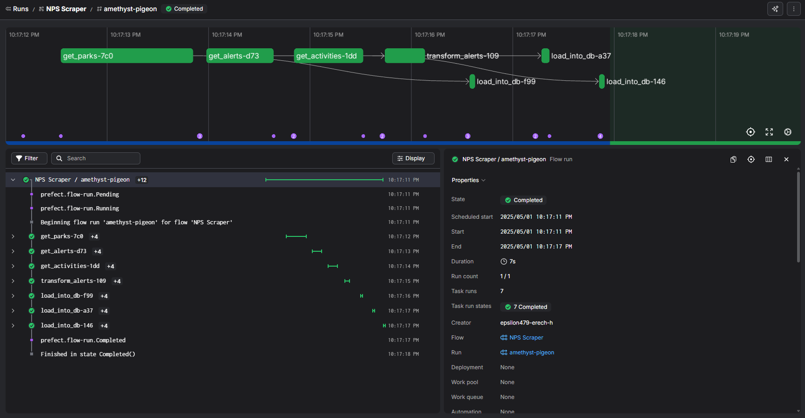
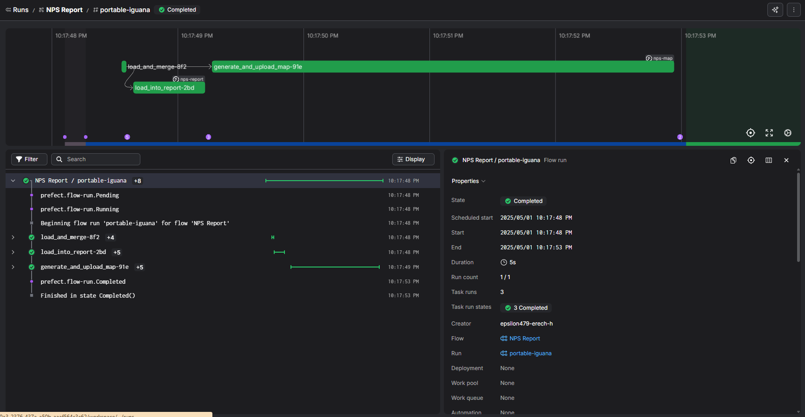
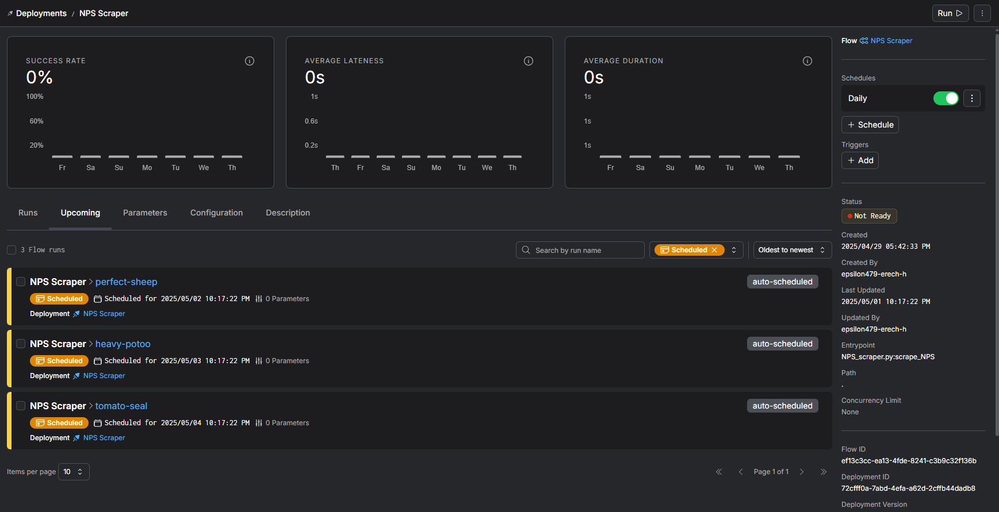

## Abstract

This project presents the design and implementation of an ETL (Extract, Transform, Load) pipeline built to automate collecting, processing, and delivering timely insights from the National Park Service (NPS) API. Motivated by personal experiences planning trips across 21 national parks, the project addresses a persistent challenge for outdoor enthusiasts: fragmented, inconsistent access to critical park information such as closures, alerts, and available activities. While the NPS API offers structured access to this data, it remains difficult to use effectively without a more accessible interface or automation.

The developed solution leverages the Python-based orchestration tool Prefect to manage tasks and flows, ensuring that data pipelines run reliably and can be scheduled for recurring updates. Raw data from the NPS API is extracted across three key domains (parks, alerts, and activities) and then validated using Pydantic to ensure consistency and data quality. Alerts are further enriched through sentiment analysis and a custom severity scoring system, enabling travelers to filter and prioritize alerts based on urgency. The resulting structured datasets are saved in `.jsonl` format for easy reuse, analysis, and visualization.

A key deliverable is a weekly Markdown report summarizing the most relevant alerts and changes, along with an interactive map to visualize national park status. While this implementation is focused on a Minimum Viable Product (MVP), it provides a scalable foundation for future enhancements such as real-time alerting, itinerary planning, or personalized recommendations. This project demonstrates how automated data pipelines can bridge the gap between raw API data and actionable insights for end users, using modern tools in Python to improve decision-making and trip planning for outdoor adventurers and public land users.

## Motivation

Known for its natural beauty and vast wilderness, Montana is home to two of the most iconic national parks in the United States. Growing up in this awe-inspiring state instilled a deep appreciation for nature and a lifelong commitment to spending time outdoors. After moving to Colorado for college, that commitment evolved into a personal goal: to complete a backpacking trip in every U.S. national park. I have completed 21 thus far, exactly one-third of the current federally designated sites. Planning those trips has become as much a part of the experience as the trails themselves. Balancing routes, permits, weather forecasts, and increasingly, real-time alerts about fire danger, road closures, and other unexpected events is a large part of making these trips a reality.

That planning process is often frustrating at times. Information is scattered across park-specific websites, not always up to date, and hard to monitor consistently. I found myself checking the National Park Service (NPS) websites over and over before a trip, just to make sure I hadn’t missed a sudden trail closure or hazardous condition. That’s when I discovered the NPS API [@nps_api], which makes structured data on park alerts, activities, and general park info accessible through a RESTful interface. It felt like the missing link, raw access to the exact data I needed, but with none of the user-friendly polish to make it practical for regular use.

This project grew out of a desire to fill that gap. I wanted to build something that didn’t just pull park data for its own sake, but that could help travelers like me make informed decisions. With that goal, I designed an ETL (Extract, Transform, Load) pipeline in Python that could automatically turn information on park websites into usable insights for travelers and planners. This project not only fulfills a personal goal - to create a better tool for planning future trips to national parks - but also serves as a testbed for applying best practices in pipeline design, including orchestration, scheduling, data validation, and artifact generation. The system is built to be extensible, too. Future iterations could include personalized park filters, travel-ready itineraries, or real-time notifications. For now, the core functionality offers something simple but impactful: regular and reliable insight into the changing conditions across our national parks.

## Problem Statement

As mentioned above, the current method for gathering information on national parks, such as alerts and activity availability, is largely manual. Users must visit multiple NPS web pages individually to get up-to-date information. While the National Park Service (NPS) API offers structured access to data on alerts, activities, and park information, the data can be difficult to understand in its raw form. It lacks a user-friendly interface and doesn’t solve the core problem of timely, consolidated delivery. That’s where an ETL pipeline can help. By automating the collection, transformation, and distribution of this information, the pipeline reduces manual effort and creates a more reliable, centralized source of truth.

There were a myriad of ideas I wanted to implement in this project, but given the time constraints of the semester, I had to narrow in on a Minimum Viable Product (MVP). The MVP focuses on using [Prefect](https://www.prefect.io/), a Python-based workflow orchestration tool, to create a pipeline that extracts data from the NPS API, validates it with [Pydantic](https://docs.pydantic.dev/latest/), transforms it into traveler-relevant summaries, and loads it to a database so that it can be used later. The pipeline is scheduled to execute weekly, producing two main deliverables: a Markdown report summarizing the various suggestions and an interactive map showing the most recent park alerts. This MVP addresses the core workflow inefficiencies while providing a strong foundation for future expansion.

## Extract, Transform, Load (ETL) Pipeline

The core of this project implements a robust and automated ETL pipeline that collects, cleans, enriches, and stores data from the National Park Service API. The goal of this pipeline is to take raw, unprocessed data about sites owned by the NPS and turn it into meaningful, organized, and ready-to-use information for further analysis or reporting. This process is automated using [Prefect](https://www.prefect.io/), which helps break the workflow into smaller, manageable tasks that can be monitored, run on a schedule, and easily extended in the future.

### Extract - Gathering the Data

A key strength of this pipeline lies in its ability to consistently extract, clean, and validate three interconnected datasets from the NPS  API. These datasets include parks, alerts, and activities. Each of these serves a distinct purpose but are designed to integrate smoothly into a unified data pipeline.

The parks dataset provides foundational information about each site managed by the NPS. This includes the park’s name, park code, location (including state and geographic coordinates), a short descriptive overview, its designation (such as “National Park,” “Historic Site,” or “National Seashore.”), and various other features. This dataset anchors the pipeline, supplying the essential context for any mapping, alert monitoring, or activity planning feature built downstream.

The alerts dataset was the primary focus initially as I wanted to gather data that changed significantly day-to-day. It includes time-sensitive messages issued by the NPS to communicate urgent or important updates about park conditions. These messages range from weather closures and fire warnings to temporary restrictions, safety tips, and general updates on services or amenities. The content is often unstructured and highly variable in tone and detail. Because of this variability, additional downstream processing is applied later in the pipeline to assess each alert’s sentiment and severity.

Finally, the activities dataset catalogs the range of recreational and educational opportunities available across the park system. Activities can include hiking, camping, boating, wildlife viewing, ranger-led tours, and more. Each entry links one or more activities to specific parks, forming a crucial bridge between park information and user preferences.

Once these datasets are extracted from the API, they undergo a structured data validation process. Rather than loading the raw data directly into spreadsheets or data frames, this pipeline uses a more robust and maintainable approach by defining formal data models using Pydantic, a Python library that enforces data types and rules. For each dataset, a dedicated class is defined. These classes lay out the expected fields, their required formats (such as strings, floats, or lists), and any default values to use when information is missing or malformed.
This validation layer serves as a powerful early-warning system. For example, if a park’s location data is missing or incorrectly formatted, the model catches it immediately and either supplies a default value or safely omits the record, depending on the use case. Similarly, if an alert is missing a description or an activity is assigned an invalid name, these issues are surfaced and handled during validation, not later when they might cause errors in analysis.

### Transform - Enriching the Data

While all three datasets are cleaned and formatted, the alerts dataset is given special attention because it's the most dynamic and unstructured. These alerts often contain free-text descriptions that vary widely in tone, importance, and length. To make them more useful, the pipeline performs two key transformations.

#### Sentiment Analysis

The pipeline evaluates the emotional tone of each alert using a tool that measures sentiment. This helps identify whether an alert is neutral, negative (e.g., a warning or danger), or slightly positive by assigning a value between negative 1 and positive 1. For example, an alert that says "Caution: Recent bear sightings" would register as more negative than something like "Information: Parking lot construction." This helps quantify how urgent or concerning an alert might feel to a visitor.

#### Severity Scoring

Each alert also comes with a predefined category assigned by the NPS, such as "Information," "Caution," "Park Closure," or "Danger." These categories are mapped to severity scores based on how serious they are. For instance, a "Park Closure" or "Danger" alert is scored higher than a general "Information" alert. While there is no definitive answer for how severe an alert is, I use values in the range of 1-5 as a basis.

#### Final Score

To make alerts easier to sort and prioritize, the pipeline combines the sentiment and severity into a single composite score. This final score provides a way to rank alerts in terms of overall urgency and importance, taking into account both what the alert says and how it’s likely to affect visitors. This enrichment process transforms plain text into something that can be compared, filtered, and visualized. This makes it far more useful than the raw descriptions alone.

### Load - Saving the Outputs

Once all data is cleaned, validated, and transformed, it is saved into structured files (in `.jsonl` format). These files serve as the project’s internal “database” and are well-organized, easy to read, and compatible with many tools for analysis or reporting. Each of the three datasets (parks, alerts, and activities) are saved separately. This modular approach allows different parts of the data to be reused or analyzed independently depending on the needs of the application.
Early in the project, there was consideration of using a more traditional database system, such as MongoDB for flexible document storage or SQL for structured relational queries. However, given the relatively modest size of the datasets and the timeline constraints of the project, it became clear that implementing a full database was not necessary at this stage. Instead, the decision to use `.jsonl` files prioritized transparency and simplicity. This approach enabled faster iteration and easier debugging, while still leaving open the possibility of scaling up to a database-backed architecture later.

## Automation with Prefect

To ensure that the entire pipeline, from data extraction to transformation, validation, and final loading, runs in a reliable and repeatable way, I used [Prefect](https://www.prefect.io/), as it  provides a clear and scalable way to define workflows using two key building blocks: `tasks` and `flows`. Each key operation in the ETL process is defined as a `task` in Prefect. For example:

- The `get_parks()` task queries API to gather information about parks.
- The `transform_alerts()` task takes validated alerts, adding information on alert sentiment, severity, and score.
- The `load_into_db()` task handles serialization and saving of the final cleaned data to disk.

These tasks are then composed into `flows`, higher-level processes that determine the order and logic of task execution. For instance, the main `scrape_NPS()` flow coordinates the full process of extracting, validating, and saving data for all three datasets: parks, alerts, and activities. Prefect handles this orchestration automatically, so that tasks are executed in the proper sequence and only rerun when necessary.

Using Prefect provided several key benefits that helped shape the success and maintainability of the pipeline. It enabled easy automation, allowing flows to be scheduled for regular execution, such as weekly updates, without the need for manual triggers. Further, Prefect’s built-in user interface offered robust monitoring and logging capabilities. Each task’s status could be tracked in real-time, and logs were automatically generated, making it easy to catch and debug issues like failed downloads or other discrepancies. With each task defined independently, new functionality could be introduced with minimal disruption to the existing flow. Beyond these benefits, Prefect also made development more flexible and less error-prone. I was able to experiment with and test tasks in isolation before integrating them into the full pipeline, which made debugging more straightforward and helped ensure that each component worked correctly on its own. This modular and organized approach significantly enhanced the clarity and reliability of the overall project.

## Artifacts and Useful Output

Beyond processing and saving structured data, the pipeline also produces two final artifacts. These user-facing outputs represent the culmination of the ETL process and its real-world utility.  To generate these artifacts, a second Prefect flow was created specifically for the reporting and visualization steps. Each artifact highlights a different aspect of the data and serves a distinct purpose for end users. An example run of this flow from the Prefect UI is shown below.

### Markdown Report

The first artifact is a generated Markdown report, built by pulling insights from the processed park and alert data. This report includes several key summaries and visual highlights: the total number of alerts across all parks, a breakdown of the most common alert types, and a ranked list of parks experiencing the highest number of active alerts. It also includes detailed tables showing parks ranked on different metrics, with direct links to the park pages. Behind the scenes, generating this report required substantial data transformation like grouping, filtering, and summarizing. Functions like `aggregate_data()` and `get_top_sites()` were developed to handle these transformations cleanly and consistently. The final report is written to markdown using a custom function and is designed to be portable. It can be embedded directly into a website, emailed as part of a weekly digest, or converted into HTML or PDF for broader distribution. Since it is regenerated automatically whenever the pipeline runs, it provides accurate updates about conditions across the National Park system, without requiring manual reporting or analysis. Below is an example of this report.



### Interactive Alert Map

The second, and more technically complex, artifact is an interactive map showing all parks that currently have active alerts. This map was created using Python plotting libraries and geographic coordinates from the alerts dataset. The steps involved were:

1. Generating an interactive map with alerts plotted using `folium`
2. Saving the plot locally as an HTML
3. Accessing my domain and hosting the HTML there
4. Retrieving and storing the URL of the hosted plot to make it accessible to users

This process of generating a link artifact, a dynamic reference to an externally hosted image, was not covered in most Prefect tutorials and required some custom logic to attach the image’s URL as metadata to the flow run. The artifact value is the visual and geographic dimension it adds to the data. Users can quickly understand which regions are affected by alerts without scanning a long list. The artifact is linked here: [Interactive Alert Map](https://gjl.georgetown.domains/5500-project/map.html)

### Future Work

This project was scoped to deliver a functional MVP pipeline that automates the extraction and processing of key data from the NPS API. However, several enhancements could significantly expand its utility:

- **User-Centric Alerts and Notifications:** Integrating a notification system (via email or SMS) would allow users to subscribe to parks or states of interest and receive real-time alerts when critical events (e.g., wildfires, road closures) are issued.
- **Dynamic Itinerary Planning:** The next step is to build a front-end application or dashboard that lets users input travel dates, preferred activities, and locations, then receive personalized recommendations and route plans using the clean datasets from this pipeline.
- **Web-Based Dashboard:** The Markdown report is a practical output, but hosting a real-time dashboard using tools like Streamlit or Dash would provide a more interactive and scalable user interface, especially for non-technical users.
- **Database Integration:** Storing processed data in a database system like SQL or MongoDB would facilitate more robust querying, historical data tracking, and multi-user access for collaborative travel planning or analytics.
- **Expanded Enrichment Pipeline:** Incorporating third-party data, such as weather forecasts, wildfire zones, or trail conditions, could help contextualize NPS alerts and increase planning accuracy.

### Conclusion

The NPS ETL pipeline bridges a practical gap between structured public data and real-world decision-making. By automating the collection and transformation of park alerts, activities, and metadata, the project makes it easier for travelers to stay informed, plan safer trips, and engage more deeply with public lands. Leveraging Prefect, Pydantic, and modern Python tools, the pipeline ensures data integrity, repeatability, and transparency.

Though this version focuses on alert summaries and basic park activity classification, it lays the groundwork for scalable enhancements. This project not only demonstrates how public data can be transformed into actionable insights but also how workflows can greatly enhance this process.

## References

::: {#refs}
:::

\newpage

## Appendix {.appendix}

### Complete Code

